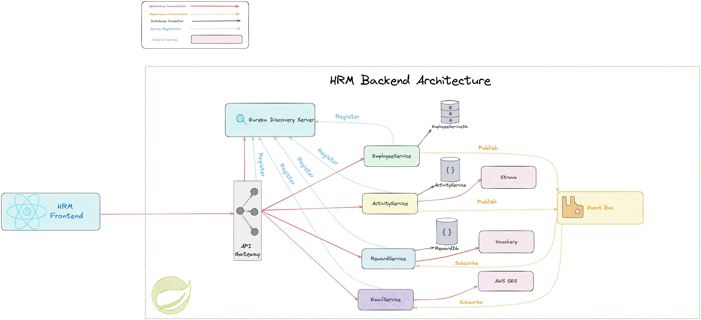

# Human Resource Management System

## Table of Contents
- [Project Overview](#project-overview)
- [Key Features](#key-features)
- [Architecture](#architecture)
- [Technologies Used](#technologies-used)
- [Prerequisites](#prerequisites)
- [Setup Instructions](#setup-instructions)
    - [Frontend Setup](#frontend-setup)
    - [Backend Setup](#backend-setup)
- [API Documentation](#api-documentation)


## Project Overview

This Human Resource Management (HRM) system is built on a microservice architecture, designed to efficiently manage various aspects of HR operations. The project combines a React frontend with a Spring Boot backend, utilizing modern technologies to create a scalable and robust solution.



## Key Features

- Microservice architecture for modular and scalable development
- Service discovery and registration using Eureka
- API Gateway implemented with Spring Cloud Gateway
- Asynchronous communication between services via RabbitMQ
- Integration with third-party services (Strava API, AWS SES, Vouchery API)

## Architecture

The system is composed of the following main components:

1. Frontend: React-based client application
2. Backend Services:
    - EmployeeService: Manages employee information and requests
    - ActivityService: Handles employee activity data (integrates with Strava API)
    - EmailService: Manages email communications (uses AWS SES)
    - RewardService: Manages reward points and vouchers (integrates with Vouchery API)
3. Infrastructure:
    - Eureka Server: For service discovery and registration
    - API Gateway: Routes requests to appropriate services
    - RabbitMQ: Message broker for asynchronous communication

## Technologies Used

- Frontend: React, Vite
- Backend: Spring Boot, Java 21
- Databases: MySQL, MongoDB
- Message Broker: RabbitMQ
- Service Discovery: Eureka
- API Gateway: Spring Cloud Gateway
- Third-party APIs: Strava, AWS SES, Vouchery

## Prerequisites

Ensure you have the following installed:

- Java 21 and Maven
- Node.js
- Docker Desktop

## Setup Instructions

### Frontend Setup

1. Navigate to the HRM-Client folder:

    ```
    cd HRM-Client
    ```

2. Install dependencies:

    ```
    npm install
    ```

3. Start the development server:

    ```
    npm run dev
    ```

4. Access the frontend at `http://localhost:5173`

### Backend Setup

1. Set up the required Docker containers:
    - MySQL:

        ```
        docker run --name mysql -p 3306:3306 -e MYSQL_ROOT_PASSWORD=mysql -d mysql:8.0
        ```

    - MongoDB:

        ```
        docker run -d -p 27017:27017 --name mongo -e MONGO_INITDB_ROOT_USERNAME=mongo -e MONGO_INITDB_ROOT_PASSWORD=mongo mongodb/mongodb-community-server:latest
        ```

    - RabbitMQ:

        ```
        docker run -it --name rabbitmq -p 5672:5672 -p 15672:15672 rabbitmq:3.13-management
        ```

2. Configure the services:
    - Set the `Active profiles` to `dev` in `EmployeeServiceApplication` and `RewardServiceApplication`.
    - Create `.env` files for services using third-party APIs (ActivityService, EmailService, RewardService) and add the necessary credentials.
        - ActivityService (.env file):

            ```
            STRAVA_CLIENT_ID=your_strava_client_id
            STRAVA_CLIENT_SECRET=your_strava_client_secret
            ```

        - EmailService (.env file):

            ```
            AWS-SES-USERNAME=your_aws_ses_username
            AWS-SES-PASSWORD=your_aws_ses_password
            ```

        - RewardService (.env file):

            ```
            VOUCHERY_API_KEY=your_vouchery_api_key
            ```

3. Start the services in the following order:
    1. EurekaServer
    2. EmployeeService, RewardsService, ActivityService, and EmailService
    3. API-Gateway

## API Documentation
Our project uses Bruno, an open-source API client, to document and interact with the API endpoints. Bruno provides a user-friendly interface for exploring and testing API requests.
To view and use the API documentation:

Install Bruno: You can download it from the official Bruno website.
Open Bruno and navigate to the API-Collection folder in this project.


